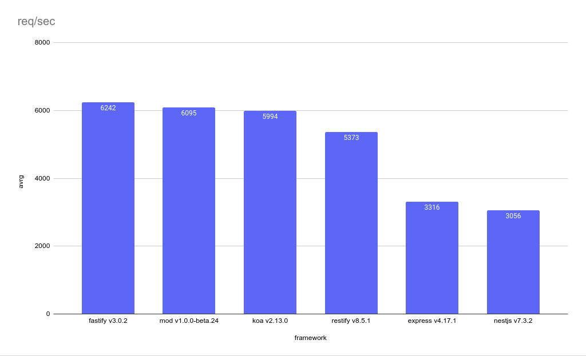

## Install

```bash
git clone --depth 1 https://github.com/ditsmod/vs-webframework.git
cd vs-webframework
npm i
```

## Run benchmarks

```bash
npm run build
npm start
ab -n 50000 -c 10 localhost:3000/hello
```

Here you need manually changes port in the range from 3000 to 3007.

"Hello, World!" performance comparison for web frameworks:

- `Fastify`
- `Ditsmod`
- `Koa`
- `Restify`
- `Express`
- `Nestjs`
- `Hapi`



The following command will allow you to view the status of running programs:

```bash
npx pm2 l
```

If you run this command immediately after running the benchmark, in particular you will see how much memory each of the applications is consuming.

Interesting information is in the `cpu` and `mem` columns. Also in `↺` column you can see number of restarting the applications.

## Stop webservers

```bash
npm run stop
```