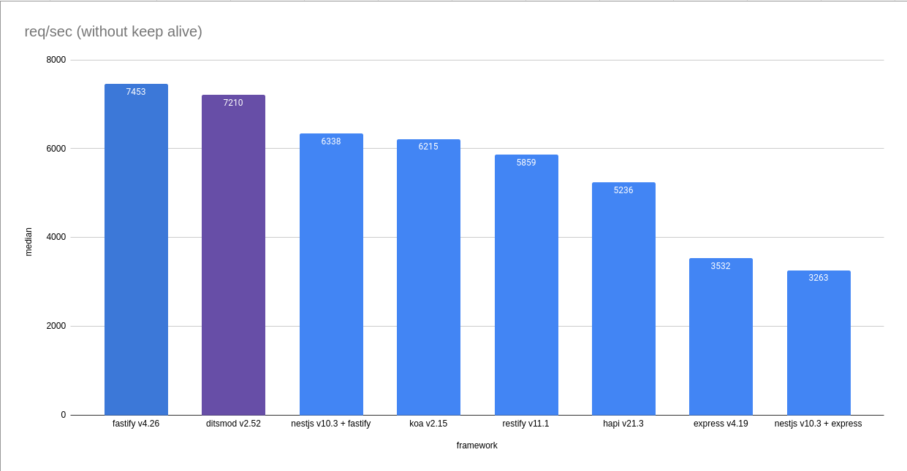

## Install and build

```bash
git clone --depth 1 https://github.com/ditsmod/vs-webframework.git
cd vs-webframework
npm i
npm run build
```

## Cold start

The shorter the cold-start time, the better the frameworks are suited for serverless technology. So, the results of a cold start are as follows:

| framework            | result, ms    |
|----------------------|:-------------:|
| ditsmod v2.47        |  21           |
| koa v2.14            |  69           |
| express v4.18        |  94           |
| fastify v4.22        |  164          |
| hapi v21.3           |  210          |
| restify v11.1        |  233          |
| nest v10.2 + express |  355          |
| nest v10.2 + fastify |  410          |

For now, this benchmark is run manually, for example:

```bash
node dist/ditsmod/main.mjs
# OR
node koa.js
# OR
node dist/nestjs/main-express.js
# ...
```

See `package.json` for more examples with start script.

## Run benchmarks

```bash
npm start
ab -n 20000 -c 10 localhost:3000/hello
# OR
wrk -t1 -c10 -d5 -H 'Connection: close' http://localhost:3006/hello
```

Here you need manually changes port in the range from 3000 to 3007.

"Hello, World!" performance comparison for web frameworks:

- `Fastify`
- `Ditsmod`
- `Koa`
- `Restify`
- `Express`
- `Nestjs + Express`
- `Nestjs + Fastify`
- `Hapi`



The following command will allow you to view the status of running programs:

```bash
npx pm2 l
```

If you run this command immediately after running the benchmark, in particular you will see how much memory each of the applications is consuming.

Interesting information is in the `cpu` and `mem` columns. Also in `↺` column you can see number of restarting the applications.

In addition, you can also check the work of Ditsmod and NestJS with controllers that are created "per request". To do this, request for the path `/hello2`, for example:

```bash
wrk -t1 -c10 -d3 -H 'Connection: close' http://localhost:3006/hello2
```

## Stop webservers

```bash
npm run stop
```