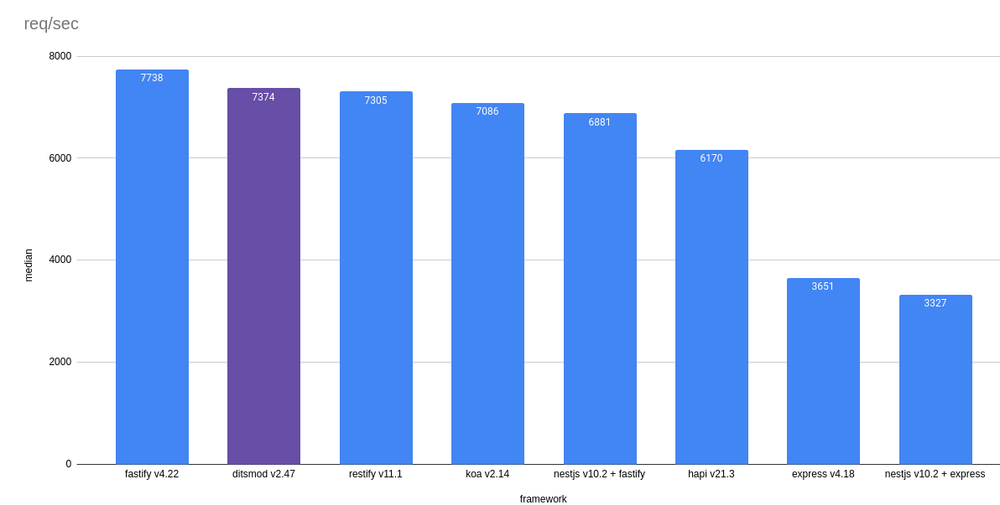

## Install

```bash
npm i
```

## Run benchmarks

```bash
npm run compile
npm start
ab -n 50000 localhost:3000/hello
```

Here you need manually changes port in the range from 3000 to 30006.

"Hello, World!" performance comparison for web frameworks:

- `Fastify` v3.0.2
- `Ditsmod` v1.0.0-beta.1
- `Koa` v2.13.0
- `Restify` v8.5.1
- `Express` v4.17.1
- `Nestjs` v7.3.2



## Stop webservers

```bash
npm run stop
```